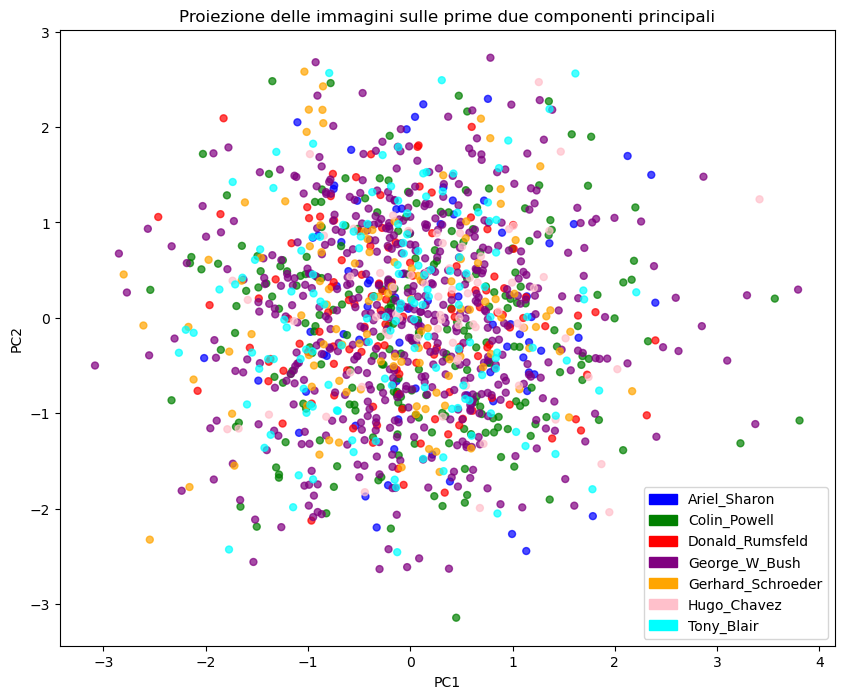

### Introduzione

L’obiettivo di questo progetto è sviluppare un sistema di classificazione di immagini che riconosca i volti di personaggi famosi. I personaggi considerati sono: Ariel Sharon, Colin Powell, Donald Rumsfeld, George W. Bush, Gerhard Schroeder e Hugo Chavez. Per raggiungere questo obiettivo ho utilizzato una Support Vector Machine preceduta da una riduzione dimensionale tramite Principal Component Analisys

### Preprocessing dei dati

Inizialmente ho esaminato i dati grezzi  per identificare i subset utili alla risoluzione del problema. Per prima cosa ho filtrato i dati che riguardavano i personaggi di interesse e ho ristrutturato il contenuto in modo da poterlo visualizzare tramite DataFrame. I dati includevano  delle associazioni tra il nome dell’immagine e del corrispondente personaggio, oltre a coppie di indici che indicavano, in parte foto dello stesso personaggio e , in altri casi, indici di foto di due personaggi diversi.

Inoltre ho anche realizzato una lista chiamata ‘nfaces ‘ contenete il numero di foto per ogni personaggio che ha portato alla luce un problema riguardo alla distribuzione squilibrata del dataset, dove alcuni personaggi avevano molte più immagini rispetto ad altri. Questo problema ha reso necessario l’utilizzo della pesatura delle classi nel modello SVM per evitare che il classificatore fosse influenzato negativamente dai personaggi con un numero di immagini maggiore

```python
nfaces: [77, 235, 121, 529, 109, 71, 144]
```

### Selezioni delle immagini e filtraggio tramite OpenCV

Ho selezionato solo le immagini dei personaggi di interesse e creato un DataFrame contenente i dati filtrati. Per migliorare la qualità delle immagini usate ho utilizzato il Cascade Classifier di OpenCV che tramite algoritmi pre-addestrati mi ha permesso di raggiungere due obiettivi principali:

- Assicurare che le immagini contenessero solo volti chiari e riconoscibili riducendo l’impatto di eventuali immagini  distorte: infatti due delle 1288 immagini totali  sono state scartate
- Ritagliare le immagini, focalizzandosi esclusivamente sui volti e riducendo il rumore causato da elementi di sfondo non necessari

### Etichettatura delle immagini

Ogni immagine è stata associata all’etichetta del personaggio corrispondente, un passaggio fondamentale per l’addestramento del modello

### PCA tramite SVD e proiezione dei dati sulle prime due componenti principali

Per soddisfare il primo punto ho calcolato il volto medio che è stato sottratto da ciascuna immagine in modo da centrare i dati. Questo passaggio è importante per bilanciare il dataset e prepararlo per l’analisi tramite la Decomposizione ai Valori Singolari. L’SVD è stata utilizzata per ottenere le componenti principali delle immagini, in particolare essa permette di scomporre la matrice iniziale nel prodotto di tre matrici U, S e VT che rappresentano rispettivamente:

- la matrice dei vettori singolari sinistri
- la matrice dei valori singolari
- la matrice dei vettori singolari destri

e tramite essa proiettiamo i dati sulle prime due componenti principali. L’analisi dello scatterplot derivato da questa proiezione ha mostrato che non si formano cluster ben definiti,  suggerendo che: 

- 2 componenti principali non sono sufficienti a definire la maggior parte della varianza (infatti per la SVM ne useremo 150)
- I dati non sono linearmente separabili in uno spazio lineare a bassa dimensionalità, richiedendo l’utilizzo di un kernel trick che proietta i dati in uno spazio a dimensione superiore dove è  possibile trovare un iperpiano di separazione tra le classi

IIn questo passaggio non ho distinto tra set di addestramento, test e validazione, poichè l’analisi era focalizzata sulla distribuzione dei dati, ma la distinzione sarà cruciale nelle fasi successive




### Training, validation e test set

Tramite la funzione train_test_split() ho diviso il dataset in tre insiemi distinti.  Il 20% dei dati è stato assegnato all’insieme di test, mentre il restante 80% è stato ulteriormente suddiviso, con il 10% utilizzato per il validation set e il restante al training set. La separazione netta di questi insiemi è fondamentale in quanto il primo viene utilizzato per addestrare il modello, il secondo per ottimizzarlo e il terzo per testarlo su dati mai visti, questo permette di evitare overfitting e valutare in modo affidabile le prestazioni del modello. Ho inoltre sottratto il volto medio calcolato sul set di addestramento e normalizzato i dati in ogni insieme, preparandoli per la riduzione della dimensionalità tramite PCA,  stavolta eseguita tramite le funzioni messe a disposizione dalla libreria sklearn 

### PCA con 150 componenti principali

Come già accennato la PCA è necessaria per ridurre la dimensionalità del problema e migliorare le prestazioni del modello. Questa quantità di componenti principali permette di preservare una quantità significativa di varianza senza compromettere eccessivamente le informazioni rilevanti per il modello

### Creazione del modello SVM con kernel RBF

La Support Vector Machine è una tecnica di classificazione supervisionata che cerca di trovare un iperpiano ottimale che separi le classi in modo da massimizzare il margine tra di esse. Nel nostro caso istanziamo una SVM con kernel RBF (radial basis function) ovvero una funzione esponenziale che permette di gestire dati che non sono linearmente separabili nello spazio originale. In particolare il kernel RBF crea combinazioni lineari delle caratteristiche per sollevare i campioni su uno spazio di caratteristiche di dimensione superiore in cui è possibile utilizzare un limite di decisione lineare per separare le classi. La funzione kernel RBF è definita come:

$$
f(x_1, x_2) = exp(\frac{-||(x_1-x_2)||^2}{2σ^2})
$$

Ovvero il kernel RBF misura la distanza tra due punti, e la funzione esponenziale decresce con l’aumentare di tale distanza. Il parametro σ determina la sensibilità del kernel alla distanza dei punti.

Nel codice istanziamo tale kernel tramite SVC ovvero Support Vector Classification che è un’applicazione della SVM per problemi di classificazione. Tra i suoi parametri specifichiamo il tipo di kernel e specifichiamo anche class_weight = ‘balanced’ per contrastare il problema dello sbianciamento delle classi precedentemente accennato. Infatti i pesi delle classi sono calcolati come l’inverso della frequenza di ciascuna classe nel dataset e ciò aiuta a migliorare le prestazioni nella predizione delle classi minoritarie e a bilanciare il modello. 

### Ottimizzazione del modello

Infine ho ottimizzato il modello utilizzando la ricerca a griglia e la k-fold cross validation tramite GridSearchCV. GridSearchCV esegue una ricerca esaustiva su una griglia di parametri specificati. Tale processo consiste nel valutare diversi parametri di C (che rappresenta il compromesso tra l’ampiezza del margine e la penalizzazione degli errori di classificazione) e gamma (che influisce sull’ampiezza della funzione di base radiale), e scegliere la combinazione che migliora l’accuratezza del modello

$$
auto: gamma = \frac{1}{n_{features}}\\scale:gamma = \frac{1}{n_{features}Var(X)}
$$

Inoltre sfrutta la k-fold cross validation per valutare le prestazioni del modello per ciascuna combinazione di parametri. In particolare il dataset viene suddiviso in k=5 fold e il modello addestrato su k-1 fold, testato sul fold rimanente e il processo viene ripetuto per ogni fold. Questo processo ha portato a un miglioramento delle prestazioni migliorando l’accuratezza passando dal 82.52% all’86.41% sul validation set e dal 72.87% al 79.46% sul test set.

### Considerazioni finali

Il modello finale ha ottenuto buoni risultati con un’accuratezza del 79.56% sul test set, ma ritengo che il motivo per cui non si sia raggiunto un risultato migliore vada riscontrato nel fatto che il peso delle classi non è sufficiente a contrastare una probabile distorsione del volto medio che potrebbe riflettere eccessivamente alcune caratteristiche dei volti con più immagini. Possibili soluzioni da considerare potrebbero essere: implementare tecniche i data augmentation o uniformare il numero di foto per ogni personaggio. Ho tentato la seconda opzione assegnando ad ogni personaggio 71 immagini, pari a quelle  del personaggio con meno immagini. Tuttavia anche in questo caso il modello ha performato peggio, accuratezza del 66% sul test set, a causa di underfitting. Infatti passando da un dataset di 1286 immagini a un dataset di 497 il modello non ha avuto sufficienti dati per essere in grado di differenziare le classi .
